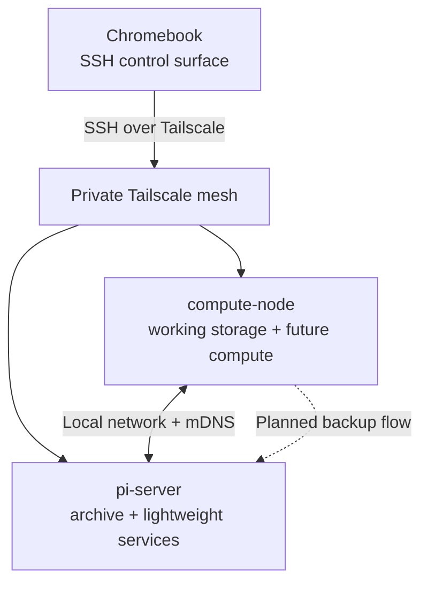

# Home Lab Architecture

This diagram reflects the verified, public-safe topology recorded in
[`../STATUS.md`](../STATUS.md). It intentionally omits operational addresses,
device identifiers, credentials, and service details.

## Verified now

- Both servers run Ubuntu Server 26.04.
- SSH uses keys; password authentication is disabled and independently tested.
- Tailscale connects the Chromebook and both servers without public port
  forwarding.
- The servers resolve each other's `.local` names.
- The Chromebook Linux environment uses Tailscale addressing because `.local`
  resolution there is not yet reliable.

## Planned, not yet claimed as implemented

- A defined backup job from working data on `compute-node` to `pi-server`
- A tested restore procedure
- Dockerized services and their service-level topology
- PostgreSQL and the dataset-provenance workflow

Update this diagram only when the corresponding state is verified and recorded
in `STATUS.md`.
