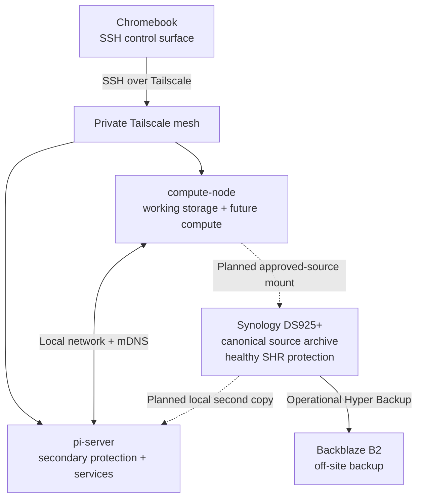

# Home Lab Architecture

This diagram reflects the verified, public-safe topology recorded in
[`../STATUS.md`](../STATUS.md). It intentionally omits operational addresses,
device identifiers, credentials, and service details.

```mermaid
flowchart TD
    C["Chromebook<br/>SSH control surface"] -->|"SSH over Tailscale"| T["Private Tailscale mesh"]
    T --> N["compute-node<br/>working storage + future compute"]
    T --> P["pi-server<br/>secondary protection + services"]
    N <-->|"Local network + mDNS"| P
    N -.->|"Planned approved-source mount"| S["Synology DS925+<br/>canonical source archive<br/>healthy SHR protection"]
    S -.->|"Planned local second copy"| P
    S -->|"Operational Hyper Backup"| B["Backblaze B2<br/>off-site backup"]
```

## Verified now

- Both servers run Ubuntu Server 26.04.
- SSH uses keys; password authentication is disabled and independently tested.
- Tailscale connects the Chromebook and both servers without public port
  forwarding.
- The servers resolve each other's `.local` names.
- The Chromebook Linux environment uses Tailscale addressing because `.local`
  resolution there is not yet reliable.
- The Synology NAS is local-network accessible and is the canonical source
  archive under D19.
- Two matching 16 TB drives are installed in one healthy SHR pool with one-drive
  fault tolerance; both drives passed extended S.M.A.R.T. tests.
- The first data scrub completed successfully, quarterly scrubbing is scheduled,
  and DSM warning/critical email delivery was tested.
- Synology Hyper Backup to Backblaze B2 is owner-confirmed operational for
  selected current NAS personal content.

## Planned, not yet claimed as implemented

- The `compute-node` working mount and metaphase share permissions
- A local second copy from the NAS to `pi-server`
- A tested restore procedure
- Dockerized services and their service-level topology
- PostgreSQL and the dataset-provenance workflow

Update this diagram only when the corresponding state is verified and recorded
in `STATUS.md`.
